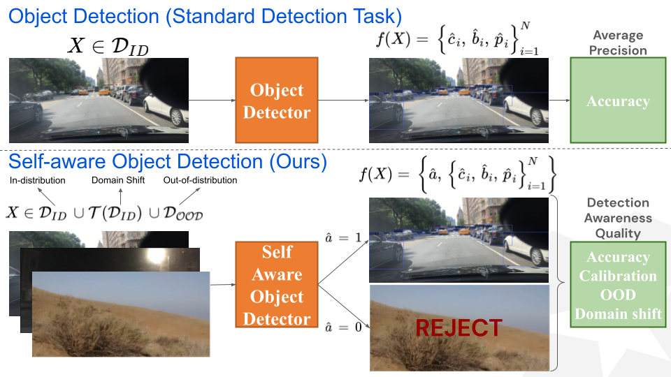

# Towards Building Self-Aware Object Detectors via Reliable Uncertainty Quantification and Calibration

The official implementation of Self-aware Object Detectors. Our implementation is based on [mmdetection](https://github.com/open-mmlab/mmdetection).

> [**Towards Building Self-Aware Object Detectors via Reliable Uncertainty Quantification and Calibration**](https://openaccess.thecvf.com/content/CVPR2023/papers/Oksuz_Towards_Building_Self-Aware_Object_Detectors_via_Reliable_Uncertainty_Quantification_and_CVPR_2023_paper.pdf),
> Kemal Oksuz, Tom Joy, Puneet K. Dokania,
> *CVPR 2023*
> [(Appendices)](https://openaccess.thecvf.com/content/CVPR2023/supplemental/Oksuz_Towards_Building_Self-Aware_CVPR_2023_supplemental.pdf)


## What is Self-aware Object Detection?

The standard approach to evaluate an object detector assumes that the test images belong to the same distribution from which the training examples are sampled. The common metric of such evaluation is the Average Precision which indicates how accurate a detector is. However, in practical applications, the test sample can be very different compared to the training ones. For example, there can be scenes with the objects similar to the ones in the training set but in very different environments, known as *domain shift*. Or, these scenes can differ completely from the training set, referred here as *out of distribution* scenes. Considering these, we design **Self-aware Object Detection** task. As illustrated in the figure below, a self-aware object detector first decides whether it can reliably operate on a scene represented by the binary variable a. If it accepts the image, it produces *accurate and calibrated detections*. We evaluate such detectors considering: 

- accuracy measured by [LRP Error](https://arxiv.org/pdf/2011.10772.pdf),
- calibration by measured by Localistion-aware ECE (LaECE) proposed in this paper,
- image-level out of distribution detection, and
- domain shift.

To enable this task, we introduce datasets, performance measures as well as investigate uncertainty quantification and calibration of object detectors. Accordingly, this repository provides these necessary tools for self-aware object detection as well as for enabling self-aware object detectors as described in our paper.


<p align="center">
  
</p>


## 1. Specification of Dependencies and Preparation

### Preparing MMDetection

Please see [get_started.md](docs/en/get_started.md) for requirements and installation of mmdetection. 

### Additional Dependencies and Preparation for this Repository
Having completed the standard preparation of mmdetection, please make the following additional changes:

- Please create `detections` directory in the root of the directory. This will include the json files with the attached uncertainties after making inference.
- Please create `results` directory in the root of the directory. This will include the evaluation logs.
- Please replace the standard cocoapi with the one that includes LRP Error using [this repository](https://github.com/kemaloksuz/LRP-Error). Specifically, rune the following commands:

```
# Remove the standard pycocotools
pip uninstall pycocotools

# Install pycocotools with LRP Error
pip install "git+https://github.com/kemaloksuz/LRP-Error.git#subdirectory=pycocotools"
```

### Preparing Datasets

Please see [SAOD datasets](docs/en/4_saod_datasets.md) for configuration of the datasets.

## 2. Used Conventional Object Detectors
Here, we provide the models that we use in this project. You can either download the models and use them, or else you can train them using the provided configuration files.

### Using Trained Detectors

#### Conventional Detectors Trained using COCO training set (General Object Detection Use-case)

|    Method     | AP | LRP[1]  | Config | Model |
| :-------------:| :------------: | :------------: | :-------: | :-------: |
| Faster R-CNN |    39.9   |  59.5    | [config](configs/saod/training/faster_rcnn_r50_fpn_straug_3x_coco.py) | [model](https://drive.google.com/file/d/1SdiPqK7IknEiFJVm7Mol66xgqxTY5FFT/view?usp=drive_link) |
| RS R-CNN |   42.0  |   58.1   | [config](configs/saod/training/rs_faster_rcnn_r50_fpn_straug_3x_coco.py) | [model](https://drive.google.com/file/d/1iUUU5K3PJm7XwOXGhZQlS67TNCT1Txaa/view?usp=drive_link) |
| ATSS |      42.8  |   58.5   | [config](configs/saod/training/atss_r50_fpn_straug_3x_coco.py) | [model](https://drive.google.com/file/d/1KqI06A9TdqS_XXLbP3j4o1dRY7C9QD-w/view?usp=drive_link) |
| Deformable DETR |    44.3    |  55.9    | [config](configs/saod/training/deformable_detr_r50_16x2_50e_coco.py) | [model](https://drive.google.com/file/d/1d_lvU1Y6IRCwO8-IjCdi2kLOvJJWY1r_/view?usp=drive_link) |
| NLL  R-CNN |    40.1    |   59.5   | [config](configs/saod/training/nll_prob_faster_rcnn_r50_fpn_straug_3x_coco.py) | [model](https://drive.google.com/file/d/1pxoVmkiZ0RT8_tiwCSkWO0htG6cj4fjd/view?usp=drive_link) |
| Energy-Score R-CNN |     40.3   |  59.4    | [config](configs/saod/training/es_prob_faster_rcnn_r50_fpn_straug_3x_coco.py) | [model](https://drive.google.com/file/d/1gsH-SKr2U4mVwUjeSzuqCBQ5VDQHL4FE/view?usp=drive_link) |

#### Conventional Detectors Trained using nuImages training set (AV Object Detection Use-case)

|    Method     | AP | LRP[1]  | Config | Model |
| :-------------:| :------------: | :------------: | :-------: | :-------: |
| Faster R-CNN |    55.0   |   43.6   | [config](configs/saod/training/faster_rcnn_r50_fpn_straug_3x_nuimages.py) | [model](https://drive.google.com/file/d/1rThEUhlMUzmidGfQeYInKWgq_k1nG8os/view?usp=drive_link) |
| ATSS |    56.9    |  43.2    | [config](configs/saod/training/atss_r50_fpn_straug_3x_nuimages.py) | [model](https://drive.google.com/file/d/1KqI06A9TdqS_XXLbP3j4o1dRY7C9QD-w/view?usp=drive_link) |

Note: While AP is a higher-better measure, LRP indicates the error, hence lower is better.

All models are included [here](https://drive.google.com/drive/folders/1Gm5gJS84b8B2wX13QVilN7Aj3nXP6PAT?usp=sharing). After downloading the models, please include them under `work_dirs` directory. For example for Faster R-CNN, the model should ideally be placed in `work_dirs/faster_rcnn_r50_fpn_straug_3x_coco/epoch_36.pth`.

### Training the Detectors
Alternatively, the models can be trained. The configuration files of all models listed above can be found in the `configs/saod/training` folder. As an example, to train Faster R-CNN on 8 GPUs, use the following command:

```shell
 tools/dist_train.py configs/saod/training/faster_rcnn_r50_fpn_straug_3x_coco.py 8
```

This repository also includes the implementation of probabilistic object detectors minimizing Negative Log Likelihood[2] or Energy Score[3].

## 3. Inference with Detection-level Uncertainties Attached

`configs/saod/test` includes all of the configuration files that we use for testing. In that directory, there is a seperate directory for each detector that includes the necessary test configuration files for making an object detector self-aware and evaluating it. Specifically, there are five configuration files for each detector. To illustrate on our general object detection setting using Faster R-CNN: 

- faster_rcnn_r50_fpn_straug_3x_coco: Standard validation set evaluation
- faster_rcnn_r50_fpn_straug_3x_coco_pseudoid.py: Validation set with the images including objects
- faster_rcnn_r50_fpn_straug_3x_coco_pseudoood.py: Validation set with the images in which the objects are padded
- faster_rcnn_r50_fpn_straug_3x_coco_obj45k.py: Obj45K test set and its corrupted versions for evaluating the SAOD
- faster_rcnn_r50_fpn_straug_3x_coco_sinobj110kood: OOD test set for evaluating the SAOD 

Obtaining SAODets and evaluating them require COCO-style json outputs with detection-level uncertainties attached, which can be obtained by the configuration files above. To illustrate again on Faster R-CNN, you will find entropy and dempster shafer estimations for each detection following [this configuration file](configs/saod/test/faster_rcnn_r50_fpn_straug_3x_coco/faster_rcnn_r50_fpn_straug_3x_coco.py). As a result, each detection is now represented by a bounding box, a class id, a detection confidence score and a set of pre-defined uncertainty values in the resulting json file. Note that 1-p_i is obtained using the detection confidence score, hence it is not explicitly stated as an uncertainty type in the configuration file. The uncertainty estimations supported by this repository is implemented [in this script](mmdet/core/utils/uncertainty.py).

To obtain the desired json files, we provide a bash script template that can be utilized as:
```shell
tools/dist_test_for_saod.sh dir_name model_path num_gpus
```

Again on the same example on Faster R-CNN, the following command will generate the required 8 json files of detections (using the 5 configuration files above) under the `detections` directory:

```shell
tools/dist_test_for_saod.sh faster_rcnn_r50_fpn_straug_3x_coco work_dirs/faster_rcnn_r50_fpn_straug_3x_coco/epoch_36.pth 2
```

## 4. Making Object Detectors Self-aware and Their Evaluation

Given detection-level uncertainties on the eight necessary data splits, we can now make object detectors self-aware and evaluate them. To do so following the recommended configuration in our paper, please run the following command:

```shell
 python tools/analysis_tools/saod_evaluation.py faster_rcnn_r50_fpn_straug_3x_coco --cls_unc_type 0 --calibrate linear_regression --benchmark True
```
Note: The resulting DAQ might differ 0.1-0.2 compared to our results in Table 6. This is because we generate corruptions on the fly and fixed a minor bug in the code.

Furthermore, the ```saod_evaluation``` script has several optional arguments facilitating the reproduction of the most of our ablation experiments and analyses in the paper. Please check out `parse_args()` function for the specifications of the arguments [in this script](tools/analysis_tools/saod_utils.py). To illustrate some:

- One can use the average determinant of the covariance matrix of top-2 detections in NLL-Faster R-CNN and calibrate the detections with isotonic regression:

```shell
 python tools/analysis_tools/saod_evaluation.py faster_rcnn_r50_fpn_straug_3x_coco --loc_unc_type 3 --max_det_num 2 --calibrate isotonic_regression --benchmark True
```

- Alternatively, the baseline method in Table 7 in the paper (a detection confidence threshold of 0.50, image-level uncertainty threshold of 0.95 and no calibrator) that we use for ablation can be obtained by:

```shell
 python tools/analysis_tools/saod_evaluation.py faster_rcnn_r50_fpn_straug_3x_coco --cls_unc_type 0 --image_level_threshold 0.95 --detection_level_threshold 0.50 --calibrate identity --benchmark True
```

## 5. Other Features Provided in this Repository


### Evaluate only OOD performance using AUROC

```shell
 python tools/analysis_tools/saod_evaluation.py faster_rcnn_r50_fpn_straug_3x_coco --ood_evaluate True
```

### Evaluate only accuracy and calibration using LRP Error and LaECE


```shell
python tools/analysis_tools/saod_evaluation.py faster_rcnn_r50_fpn_straug_3x_coco --calibrate isotonic_regression
```

### Plot reliability Diagrams

```shell
python tools/analysis_tools/saod_evaluation.py faster_rcnn_r50_fpn_straug_3x_coco --calibrate isotonic_regression --plot_reliability_diagram True
```

### Standard COCO Style Evaluation using AP and LRP Error
```shell
python tools/analysis_tools/saod_evaluation.py faster_rcnn_r50_fpn_straug_3x_coco --evaluate_top_100 True
```

## How to Cite

Please cite the paper if you benefit from our paper or the repository:
```
@inproceedings{saod,
       title = {Towards Building Self-Aware Object Detectors via Reliable Uncertainty Quantification and Calibration},
       author = {Kemal Oksuz and Tom Joy and Puneet K. Dokania},
       booktitle = {Conference on Computer Vision and Pattern Recognition (CVPR)},
       year = {2023}
}
```
### References

[[1](https://arxiv.org/pdf/2011.10772.pdf)] One Metric to Measure them All: Localisation Recall Precision (LRP) for Evaluating Visual Detection Tasks, TPAMI in 2022 and ECCV 2018  
[[2](https://arxiv.org/pdf/1809.08545.pdf)] Bounding Box Regression with Uncertainty for Accurate Object Detection, CVPR 2019  
[[3](https://arxiv.org/pdf/2101.05036.pdf)] Estimating and Evaluating Regression Predictive Uncertainty in Deep Object Detectors, ICLR 2021
